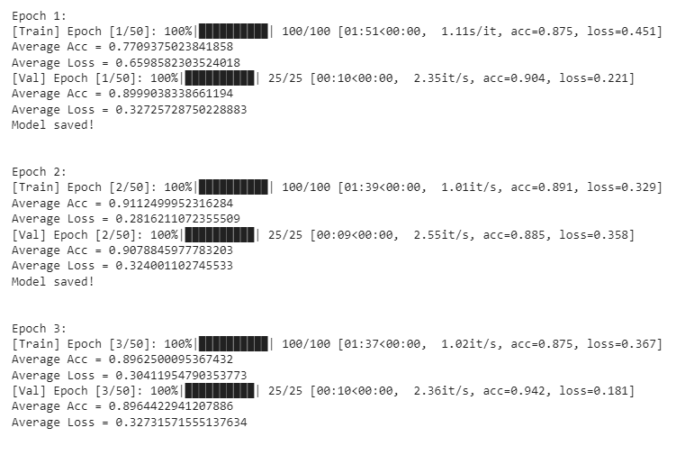

```{python, echo=F, eval=F}
# !pip install pandas numpy sklearn imblearn matplotlib nltk seaborn torch torchvision torchaudio tqdm openai plotly xgboost transformers
```

# Baseline

We've already seen that we can easily get 90% accuracy, by using Naive
Bayes over the `description` column. We'll consider 90% accuracy as the
baseline for later trials.

\

# Just For Fun

## ChatGPT

First, let's see how well zero-shot approach works. We will use the
pre-trained model, ChatGPT-3.5, to predict the class based on the
`brand` and `description` columns.

Simplified example of use for 100 snacks:

```{python, eval=F}
import pandas as pd
from helpers.chatgpt import gpt_zero_shot_classify
import os
# make sure OPENAI_API_KEY env variable is set to the api key.


train_samples = pd.read_csv('data/food_train.csv').head(100)

snacks_texts = train_samples.apply(lambda row: f'{row.idx}. brand: {row.brand}; description: {row.description}', axis=1).tolist()

gpt_pred = gpt_zero_shot_classify(snacks_texts) # list of 100 predictions
```

Checking performance:

```{python}
import pandas as pd
from sklearn.metrics import classification_report


train_samples = pd.read_csv('data/food_train.csv').head(500)

y_pred = pd.read_csv('data/gpt_output_500.csv', index_col=0)
y = train_samples['category']

print(classification_report(y, y_pred))
```

We've got better results by applying Naive Bayes over the desctiption
alone. A big pretrained language model zero-shot predictions surely
might add some information, but in my opinion it doesn't worth the
effort in this case.

\

## GPT embeddings

I also tried to check the classification with GPT embeddings using this
guide:

-   <https://github.com/openai/openai-cookbook/blob/main/examples/Zero-shot_classification_with_embeddings.ipynb>

-   <https://github.com/openai/openai-cookbook/blob/main/examples/Classification_using_embeddings.ipynb>

but achieved even lower accuracy (\<70).

With that episode behind us, let's start building our final model.

\*\*All code available at `helpers/chatgpt`.

\

# Fine-Tuning BERT

At first, we thought that most of the information is stored within the
textual columns. Hence, it makes sense to try transformers based models,
such as BERT, a pre-trained natural language processing model developed
by Google.

We were fine-tuning BERT (unfreezing last 2 layer block, total of 32
layers), with the code found in `bert.py`. I checked and training runs
smoothly if having all the dependencies & enough memory for stated
`BATCH_SIZE`.

We found out that XGBoost gets better performance, which I found a bit
surprising as big transformer models suppose to be able to capture deep
contextual relationships within text. A reasonable explanation is that
the information besides the textual data give XGBoost a significant
advantage.

Here are the first 3 epochs of training with the latest configuration I
was trying:

 With appropriate learning
rate decay, the highest validation epoch accuracy I've seen was 94.5. I
decided to drop the model and use trees based models for the final
prediction.

\

# Pre-processing Stages

I will be using the following classes to preprocess the data within an
`imblearn` pipe, before training any machine learning models.

-   **FillNA** - Filling all NA's with the string "na".

-   **MergeWithFoodNutrients** - Merge the food dataframes with the
    nutriests & food_nutrients merged dataframe, as in Part 1.

    -   *nutrient_min_freq* - Minimum frequency for the nutrient to
        found in different snacks, else column will be dropped.

-   **DropColumns**

-   **NaiveBayesScores** - Adds the Naive Bayes scores for each category
    (total 6), or the count vectorization without applying the Naive
    Bayes model, for a given textual column.

    -   *colname* - The required textual column.

    -   *preprocess_func* - preprocessing func to apply over the textual
        column before doing anything else.

        *vectorizer_kwgs* - kwargs for the vectorizer (as in
        sklearn.feature_extraction.CountVectorizer & TfidfVectorizer.

    -   *mode* - "scores" for the Naive Bayes scores, or "count" for
        vectorize to textual column without applying Naive Bayes. The
        latter may result in adding a significant number of columns to
        the dataset (one for each unique word/n-gram). I'll be
        controlling the number of column by tuning the vectorizer
        kwargs, such as removing stop-words, stripping accent into ascii
        letters, including only tokens with `min_df` occurrences.

    -   *use_tfidf* - True for TfidfVectorizer, False for
        CountVectorizer (empirically works better).

-   **CleanAndListifyIngredients** - As described in Part 1. removes
    text inside () and [], some regexing for cleaning the ingredients.
    Ingredient containing more than a single word, will be spaced by an
    underscore, and different ingredients will be separated by a single
    space " ".

    -   *keep_top_n* - Keep only first n ingredients.

-   **StandardScale** - Standard scaler wrapper, to bypass the 'idx'
    column. Not important for tree based models.

-   **StemDescription** - Omitting description words suffixes, as in
    `nltk.stem.snowball.SnowballStemmer` .

        Few Rules:
        ILY  -----> ILI
        LY   -----> Nil
        SS   -----> SS
        S    -----> Nil
        ED   -----> E,Nil

-   **AddImportantTokens** - Not in use. Adding only tokens passing some
    importance threshold.

-   **AddCategoryTokensAppearance** - Not in use. Adding a column for
    each word in the categories, if they're found in a textual column.

After many trials, we decided to build the following pipe:

```{python}
from helpers.preprocess import (
    FillNA,
    MergeWithFoodNutrients,
    CleanAndListifyIngredients,
    NaiveBayesScores,
    LogTransformation,
    DropColumns,
    StemDescription,
)
from imblearn.pipeline import Pipeline

steps = [
    FillNA(),
    MergeWithFoodNutrients(nutrient_min_freq=2),
    CleanAndListifyIngredients(),
    StemDescription(),
    NaiveBayesScores(colname="brand", preprocess_func=lambda x: x.replace(" ", ""),
            vectorizer_kwgs=dict(
            stop_words="english", ngram_range=(1, 6), strip_accents="unicode", min_df=20
        ),
        mode="count",
        use_tfidf=False,
    ),
    NaiveBayesScores(
        colname="description",
        vectorizer_kwgs=dict(
            stop_words="english", ngram_range=(1, 6), strip_accents="unicode", min_df=50
        ),
        mode="count",
        use_tfidf=False,
    ),
    NaiveBayesScores(
        colname="ingredients",
        vectorizer_kwgs=dict(
            stop_words="english", ngram_range=(1, 6), strip_accents="unicode", min_df=50, max_df=0.6
        ),
        mode="count",
        use_tfidf=False,
    ),
    NaiveBayesScores(
        colname="household_serving_fulltext",
        vectorizer_kwgs=dict(stop_words="english", ngram_range=(1, 6), strip_accents="unicode", min_df=50),
        mode="count",
        use_tfidf=False,
    ),
    LogTransformation(columns=["serving_size"]),
    DropColumns(columns=["serving_size_unit"]),
]


pipe = Pipeline([(f"{i}", step) for i, step in enumerate(steps)])
```

This pipe results in a wide matrix (\~2000 columns), since we use the
`mode="count"` option within the `NaiveBayesScores`, meaning we ask to
keep a count column for each token with frequency \> `min_df`.

During the exploration stage, we found that chocolate is a hard category
to predict. Moreover, it is not a frequent category compared to the
others. We tried utilizing SMOTE to help us overcome this issue, but
results weren't significantly better. It might be due to the fact that
we tried oversampling at early stages, while we were still extracting
features, and if we'd try it now it might work better.

\

# ResNet18 Score Features

\*\* Code is based on
<https://pytorch.org/tutorials/beginner/transfer_learning_tutorial.html>

We'll start with utilizing the images in the dataset. To be honest, it
was not straight forward to decide how to combine the images with the
structured data. I was using 2 different methods. For this part, a
ResNet18 model is used. All model's weights are frozen except the last
layer / few layers. The model is trained for 100 epochs with a learning
rate of 0.001, decay by a factor of 0.1 every 7 epochs.

I was trying 2 different approcaches:

1.  Fine-tuning ResNet18, replacing the last layer with 6 outputs.
2.  Fine-tuning ResNet18, replacing the last layer with n outputs
    (6\<=n\<=256), concatenating the "last layer" output with the
    structured features, adding [FC -\> BN -\> RELU] blocks afterwards,
    finally resulting to 6 scores.


Code is available at `helpers/resnet.py`, although as you can imagine
from the description, code has been through lots of changes. The
`ResNet18ForSnacks` class shows the last architecture I was trying.

Let's find out how well we can predict the class, by following the first
approach (images only):

```{python}
from sklearn.metrics import accuracy_score


rn18_train = pd.read_csv(f"data/_resnet18_train_features_fine_tuned.csv", index_col=0)

y = rn18_train['y']
y_pred = rn18_train.drop(columns='y').idxmax(axis=1).astype('int')
print(f'accuracy: {round(accuracy_score(y, y_pred), 2)}')
```

Not too bad, though not especially good either. **We'll add those scores
as 6 new columns.**

```{python}
from sklearn.model_selection import train_test_split


def get_train_val_test():
    food_train = pd.read_csv("data/food_train.csv")
    
    features_df = food_train.drop("category", axis=1)
    labels_df = food_train["category"]
    
    image_scores_df = (
        pd.read_csv(f"data/resnet18_food_train_features_fine_tuned.csv", index_col=0)
        .set_index(food_train.index)
        .drop(columns=["y"])
        .add_prefix("image_scores_")
    )
    
    features_df = pd.concat([features_df, image_scores_df], axis=1)
    
    
    X_train, X_val_test, y_train, y_val_test = train_test_split(
        features_df, labels_df, test_size=0.2, random_state=42
    )
    
    
    X_val, X_test, y_val, y_test = train_test_split(
        X_val_test, y_val_test, test_size=0.25, random_state=42
    )
    
    return X_train, X_val, X_test, y_train, y_val, y_test
```

Regarding the 2nd approach, I couldn't break the barrier of 0.92
accuracy. Since my data is mostly structured after preprocessing, I
decided to put faith in trees ensemble based methods, instead of a big
unified net.

\

# Models

```{python, echo=F}
def get_test_set():
    X = pd.read_csv("data/food_test.csv")
    
    image_scores_df = (
        pd.read_csv(f"data/resnet18_food_test_features_fine_tuned.csv", index_col=0)
        .set_index(X.index)
        .add_prefix("image_scores_")
    )
    
    X = pd.concat([X, image_scores_df], axis=1)
    
    return X

def save_predictions(model, path):
    labels = [
      "cakes_cupcakes_snack_cakes",
      "candy",
      "chips_pretzels_snacks",
      "chocolate",
      "cookies_biscuits",
      "popcorn_peanuts_seeds_related_snacks"
    ]
    
    X = get_test_set()
    X = pipe.transform(X)
    
    X['pred_cat'] = model.predict(X)
    X['pred_cat'] = X['pred_cat'].apply(lambda x: x if isinstance(x, str) else labels[x])
    
    X[['idx', 'pred_cat']].to_csv(path, index=False)
    X.drop(columns=['pred_cat'], inplace=True)
```

The models we picked are the following:

-   Random Forest Classifier

-   XGBoost

-   Ensemble of XGBoosts

All models will be using the shown above pipeline for preprocessing.

For all models, CV use `X_train` as train and `X_val` for validation.
While training the final model, we'll be using `X_train + X_val` for
train and `X_test` for benchmarking performance.

## 1st Model - Random Forest Classifier

Random Forest is chosen for its robustness and ability to handle complex
relationships in data by aggregating decision trees, making it suitable
for tasks requiring feature importance and good generalization.

```{python}
X_train, X_val, X_test, y_train, y_val, y_test = get_train_val_test()
X = pd.concat([X_val, X_train], axis=0)
y = pd.concat([y_val, y_train], axis=0)
X = pipe.fit_transform(X, y)
```

Hyperparameter tuning with random search grid CV (usually works better
for many parameters, as some of them might have low impact, so we don't
have to try all of their combinations):

```{python, eval=F}
from sklearn.ensemble import RandomForestClassifier
from sklearn.model_selection import RandomizedSearchCV
from joblib import dump

# Define the parameter grid
param_grid = {
    'n_estimators': [100, 200, 300, 400, 500],  # Number of trees in the forest
    'criterion': ['gini', 'entropy'],           # Split criterion
    'max_depth': [None, 10, 20, 30, 40],        # Maximum depth of the tree
    'min_samples_split': [2, 5, 10],            # Minimum samples required to split an internal node
    'min_samples_leaf': [1, 2, 4],              # Minimum number of samples required to be at a leaf node
    'bootstrap': [True, False],                 # Whether bootstrap samples are used
    'random_state': [42]                        # Random seed for reproducibility
}

# Create a RandomForestClassifier
rf_classifier = RandomForestClassifier()

# Create RandomizedSearchCV
random_search = RandomizedSearchCV(
    estimator=rf_classifier,
    param_distributions=param_grid,
    n_iter=50,            # Number of parameter settings that are sampled
    scoring='accuracy',   # Scoring metric for evaluation
    cv=5,                 # Cross-validation folds
    verbose=2,
)

# Fit the RandomizedSearchCV to your data
random_search.fit(X, y)


best_model = random_search.best_estimator_
dump(best_model, 'checkpoints/rf/best_model.joblib')
```

Benchmarking over test set:

```{python}
from joblib import load

X_test = pipe.transform(X_test)

model = load('checkpoints/rf/best_model.joblib')

y_pred = model.predict(X_test)

# Calculate the accuracy of the model
accuracy = accuracy_score(y_test, y_pred)
print("Accuracy:", accuracy)
```

Saving predictions.

```{python, eval=F}
X = get_test_set()
X = pipe.transform(X)

save_predictions(model, 'predictions/model01.csv')
```

\

## 2nd Model - XGBoost

XGBoost is selected for its efficient gradient boosting framework that
excels in structured data scenarios, such as our case.

Messing with structured data without trying the king of Kaggle in at
least one of the trials is a shame. Again, starting with random search
CV:

```{python}
dmap = {
    "cakes_cupcakes_snack_cakes": 0,
    "candy": 1,
    "chips_pretzels_snacks": 2,
    "chocolate": 3,
    "cookies_biscuits": 4,
    "popcorn_peanuts_seeds_related_snacks": 5,
}
y = y.apply(lambda x: dmap[x])
y_test = y_test.apply(lambda x: dmap[x])
```

Random Search CV:

```{python, eval=F}
from xgboost import XGBClassifier

param_grid = {
    'n_estimators': [100, 200, 300, 400, 500],
    'learning_rate': [0.01, 0.1, 0.3],
    'max_depth': [3, 5, 6, 7, 8],
    'min_child_weight': [1, 2, 4],
    'subsample': [0.8, 0.9, 1.0],
    'colsample_bytree': [0.8, 0.9, 1.0],
    'gamma': [0, 0.1, 0.3],
    'reg_alpha': [0, 0.1, 0.3],
    'reg_lambda': [0, 0.1, 0.3],
}

xgb = XGBClassifier(objective='multi:softmax', num_class=6, random_state=42)

random_search = RandomizedSearchCV(
    estimator=xgb,
    param_distributions=param_grid,
    n_iter=50,
    scoring='accuracy',
    cv=5,
    verbose=3,
    n_jobs=2,
    random_state=42
)

random_search.fit(X, y)

best_params = random_search.best_params_
best_model = random_search.best_estimator_


best_model.save_model('checkpoints/xgb/xgb.model')
```

Benchmarking over test set:

```{python}
from xgboost import XGBClassifier


best_xgb = XGBClassifier()
best_xgb.load_model('checkpoints/xgb/xgb.model')

y_pred = best_xgb.predict(X_test)

# Calculate the accuracy of the model
accuracy = accuracy_score(y_test, y_pred)
print("Accuracy:", accuracy)
```

Saving predictions:

```{python, eval=F}
save_predictions(best_xgb, 'predictions/model02.csv')
```

\

## 3nd Model - XGBoost Ensemble

XGBoost outperformed Random Forest, so we decided out last model to be
an ensemble of XGBoost models with the best parameters given by the CV.
Such ensemble would reduce the variance of a single model and hopefully
result with better predictions.

```{python, eval=F}
from sklearn.ensemble import BaggingClassifier

best_xgb = XGBClassifier()
best_xgb.load_model('checkpoints/xgb/xgb.model') # best xgb model

ensemble = BaggingClassifier(best_xgb, n_estimators=20, verbose=2, n_jobs=2, random_state=42)
ensemble.fit(X, y)


dump(ensemble, 'checkpoints/xgb_ensemble/ensemble.joblib')
```

Benchmarking over test set:

```{python}
from sklearn.ensemble import BaggingClassifier


ensemble = load('checkpoints/xgb_ensemble/ensemble.joblib')
ensemble.set_params(n_jobs=1) # to avoid SEGFAULT in rstudio

y_pred = ensemble.predict(X_test)

# Calculate the accuracy of the model
accuracy = accuracy_score(y_test, y_pred)
print("Accuracy:", accuracy)
```

Saving predictions.

```{python, eval=F}
save_predictions(ensemble, 'predictions/model03.csv')
```

\

# Conclusions

-   XGBoost out performed RF with the exact same settings.

-   Deep models such as BERT performed worse than XGBoost, **considering
    the use cases we were trying.**

-   Ensemble won't always guarantee better performance over test set.

-   Feature extraction part is super critical for good performance,
    independently to the chosen model.

-   Sklearn, pandas and pytorch offer great framework for ML.

-   Models with many features (features are almost 10% sample size) may
    still perform well, and are not easily prone to overfiting as I
    thought they would.

THANKS FOR READING!
