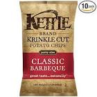
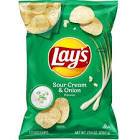

```{r, echo=FALSE, fig.align='center'}
knitr::include_graphics("images/DSApps_logo_small.jpg")
```

\newpage

## Welcome

Welcome to the Final Project!


Please read through instructions and note that although the instructions were written in R, you can work on this assignment in R, in Python or both.


* The project consists of two parts:
  - Exploratory Data Analysis (50%)
  - ML for Prediction (50%)
* The grade would be based on 4 dimensions (each worth 25%):
  - Data usage: there are 4 datasets, strive to use all in BOTH parts
  - Organization, communication, story telling: make. it. clear.
  - Effort, creativity: will you go the extra mile when needed? will you try to answer questions arising from your work?
  - Coding skills, efficiency, reproducibility
* There is another option to earn up to 10 points bonus:
  - The student with the highest classification accuracy in the prediction task will receive a 10 points bonus.
  - The next top two will receive a 5 points bonus.
* What you need to submit:
  - A statement with your name, ID number and signature, that your work was your own and your own only, see below
  - A pdf doc for EACH of the parts, can be (and I prefer) knitted from a R/Python notebook
  - NOT all code has to appear in the pdf docs, you can add CLEAR references to additional material
  - All additional materials, code in notebooks
  - For the ML prediction part, additional csv files for the unseen test data, see later
* Length limitations:
  - Both parts: at least 5 pdf pages EACH, no more than 15 EACH, including all plots and tables

The project is due: 15/8 23:59

\newpage

## Statement:

Please add this statement to the pdf you are submitting, with your full name, ID number and signature:

> I confirm that the work for the following project in the Applications of Data Science course was solely undertaken by myself and that no help was provided from other sources as those allowed.

> Name: _________________, ID: _________________, Date: _________________, Signature: _________________

\newpage

## Snacks!

Ever been to the US? One of the first things you might notice when you enter an average supermarket, is the huge variety of food products offered on display. In particular, you'd be amazed by the variety of (mostly unhealthy) snacks.

The [US Department of Agriculture](https://www.usda.gov/) maintains a rich dataset of food products and their detailed ingredients, called FoodCentral Data or [FDC](https://fdc.nal.usda.gov/). Each food product is branded, categorized and analyzed for the nutrients it is made of. There are over 300K food products listed, divided to dozens of categories, of which over 70K are snacks.

In our dataset there are ~35K snacks products (train and test combined), in 6 categories:

* Popcorn, Peanuts, Seeds & Related Snacks
* Candy
* Cookies & Biscuits
* Chips, Pretzels & Snacks
* Chocolate
* Cakes, Cupcakes, Snack Cakes

And the data contains 4 datasets:

1. `food_train.csv` and `food_test.csv`
2. `nutrients.csv`
3. `food_nutrients.csv`
4. train and test images for all snack products (separate link, see below)

See the details of each of these datasets in the Snacks Datasets section

\newpage

## The Snacks Datasets

### 1. `food_train.csv` and `food_test.csv`

```{r, message=FALSE, warning=FALSE}
library(tidyverse)

food_train <- read_csv("data/food_train.csv")

glimpse(food_train)
```

These are the main data tables for each snack on our list, columns are:

* `idx`: Snack ID
* `brand`: Snack brand
* `description`: Snack short description, sometimes simply its name
* `ingredients`: Snack list of ingredients (as it appears on the its label, i.e. a single string)
* `serving_size`: The amount of the serving size when expressed as gram or ml
* `serving_size_unit`: The unit used to express the serving size (gram or ml)
* `household_serving_fulltext`: The amount and unit of serving size when expressed in household units
* `category`: The category of the snack, assigned by [GDSN](https://en.wikipedia.org/wiki/Global_Data_Synchronization_Network#:~:text=The%20Global%20Data%20Synchronization%20Network,data%20with%20their%20trading%20partners.) or [Label Insight](https://www.labelinsight.com/)

The only difference between `food_train.csv` and `food_test.csv`: the test set does not hold the `category` column, those are safely hidden with me. The distribution of `category` however is the same.

```{r, message=FALSE, warning=FALSE}
food_test <- read_csv("data/food_test.csv")

colnames(food_test)
```

\newpage

### 2. `nutrients.csv`

```{r, message=FALSE, warning=FALSE}
nutrients <- read_csv("data/nutrients.csv")

glimpse(nutrients)
```

The table for the various nutrients found in snacks.

* `nutrient_id`: Nutrient ID
* `name`: Nutrient name
* `unit_name`: The standard unit of measure for the nutrient (per 100g of food)


### 3. `food_nutrients.csv`

```{r, message=FALSE, warning=FALSE}
food_nutrients <- read_csv("data/food_nutrients.csv")

glimpse(food_nutrients)
```

A *long* table, each snack may appear in multiple rows, with its multiple nutrients:

* `idx`: Snack ID
* `nutrient_id`: Nutrient ID
* `amount`:  Amount of the nutrient per 100g of food. Specified in unit defined in the `nutrients` table

This table has data on both train and test snacks.


### 4. train and test images for all snack products

*Email me for a link to the set of over 35K images, ~225MB when unzipped*

* Each snack has an image, the image is its `idx`, e.g. "1.jpg" for snack with `idx == 1`
* Each snack's image comes from automatically scraping Google Images and downloading the first result
* A manual scanning got rid of completely useless images, but this does NOT mean the images are all accurate and "perfect"
* At least one of the images dimensions is 140 pixels, most are 140x140
* Which "completely useless" images (and their snacks) were discarded? For example in the cookies category, there were images of:
  - logos
  - barcodes
  - generic cookies, repeating over and over again
  - people eating cookies
  - cookies stores
  - cookies books
  - cookies websites banners
  - cookies cutters
  - cookie icecreams
  - headsets. yes, headsets, because one of the brands was "Noisebusters"...
* Still, most images are very useful and do depict the snack, sometimes even differ between sub-products of the same snack

#### Example of a really good image

```{r}
food_train %>% filter(idx == 672) %>% select(brand, description)
```



It is a good image because it is the exact brand and snack described in the description, it is even different from other images of snacks in that same line.

#### Example of a not so good image

```{r}
food_train %>% filter(idx == 641) %>% select(brand, description)
```



It is a not so good image because this isn't the brand specified, Lay's is a very well known default-like brand for potato chips. It still says "potato chips", therefore the image and snack were not discarded.

\newpage

## Exploratory Data Analysis

This is you. You have 5 to 15 pdf pages to tell me what you see in the data.

Some tips:

* If you have a `ggplot` which is built with 100 lines of code, feel free to hide them in additional material with a clear reference
* You may assume I already know how many snacks there are in each category, go a little further than that
* You can either tell a story or focus on a few "research" questions which you will answer with exploratory data analysis
* There is no minimum or maximum number of plots, just do well
* Please no word clouds and no pie charts

## Prediction

In the [Price is Right!](https://github.com/DSApps-2023/HW6) competition you had to predict the log-price of women's shoes.

This. Is Classification. The metric. Is accuracy.

And, we have 6 classes as you've seen. You're probably anxious to see the class distribution:

```{r}
food_train %>% count(category, sort = TRUE)
```

As you can see the classes are not balanced but they are not very imbalanced either (the smallest `category` has over 10% prevalence).

More good news:

* There are almost no missing values this time
* It's not a very difficult classification task!

Let me demonstrate. This simple rule already achieves over 60% test accuracy (with 6 classes that's not bad):

```{r}
popcorn_peanuts_keywords <- str_c(c("almonds", "mix", "cashews", "popcorn", "seeds", "nuts", "macadamias", "peanuts", "corn", "nutty", "pistachios"), collapse = "|")
candy_keywords <- str_c(c("gummi", "gummy", "lolli", "candy", "candies", "fruit", "licorice", "drops", "confection", "chicks", "sour", "sweet", "peeps", "jelly", "dragee", "fizz", "patties", "cane"), collapse = "|")
coockies_keywords <- str_c(c("cookie", "gingernread", "chocolate chip", "macarons", "sticks", "wafers"), collapse = "|")
chips_keywords <- str_c(c("chips", "pretzel", "tortilla"), collapse = "|")
chcolate_keywords <- str_c(c("chocolate", "bar"), collapse = "|")
cakes_keywords <- str_c(c("cake", "brownie", "pie", "eclair", "donut"), collapse = "|")

predict_category <- function(description) {
  if (str_detect(description, popcorn_peanuts_keywords)) {
    return("popcorn_peanuts_seeds_related_snacks")
  }
  if (str_detect(description, candy_keywords)) {
    return("candy")
  }
  if (str_detect(description, coockies_keywords)) {
    return("cookies_biscuits")
  }
  if (str_detect(description, chips_keywords)) {
    return("chips_pretzels_snack")
  }
  if (str_detect(description, chcolate_keywords)) {
    return("chocolate")
  }
  if (str_detect(description, cakes_keywords)) {
    return("cakes_cupcakes_snack_cakes")
  }
  return("popcorn_peanuts_seeds_related_snacks")
}

food_test <- food_test %>%
  mutate(pred_cat = map_chr(description, predict_category))
```

Question is: can you go above and beyond that? Can you save large sums of money to the FDC?

You have 3 (three) attempts, that is you can submit up to 3 csv files with your predictions for the unseen test set, for 3 different models (e.g. `model01.csv`, `model02.csv` and `model03.csv`).

There is no limitation on which of the 4 data sources you should use, but you are expected to at least try to use all, e.g. you get 100% accuracy with just the descriptions? Good for you, now try with the images, or a combination of datasets.

As with the Price is Right competition, the csv file should hold only two columns: `idx` and `pred_cat` which is the predicted category, like so:

```{r, eval=FALSE}
food_test %>%
  select(idx, pred_cat) %>%
  write_csv("model01.csv")
```


Good Luck!


Giora Simchoni.